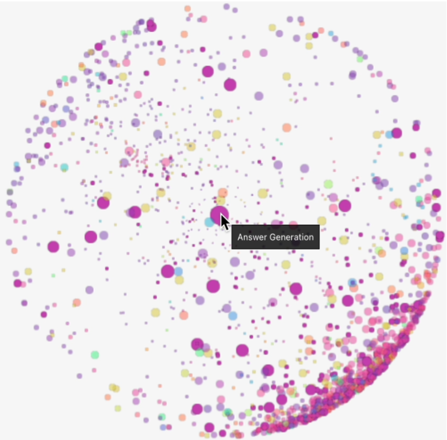
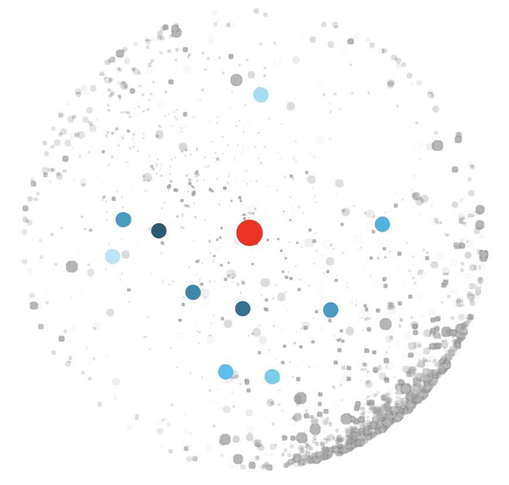
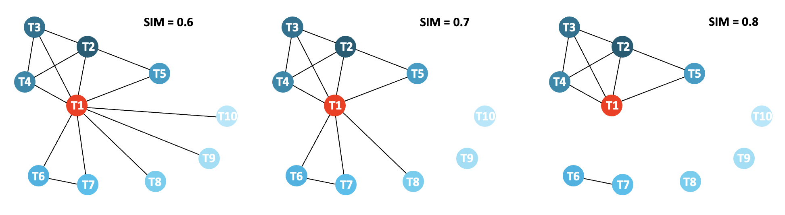
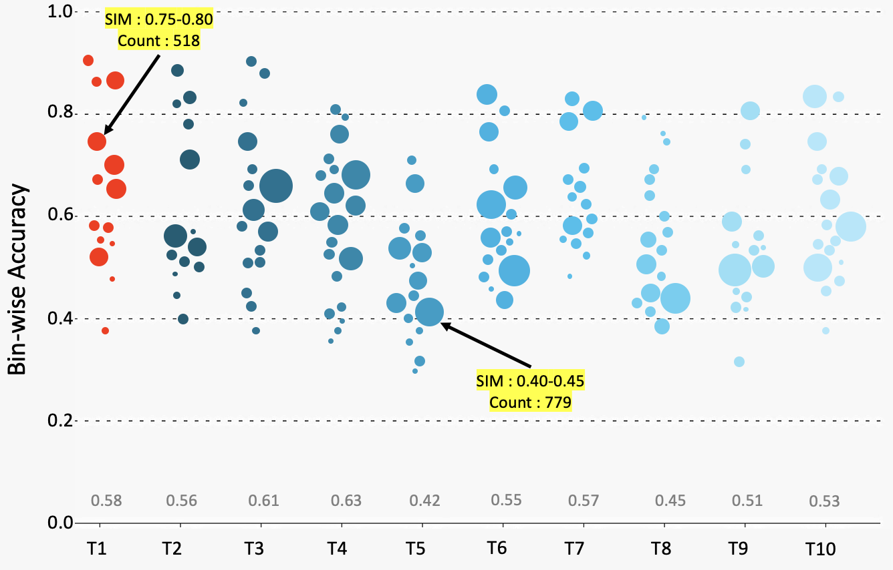
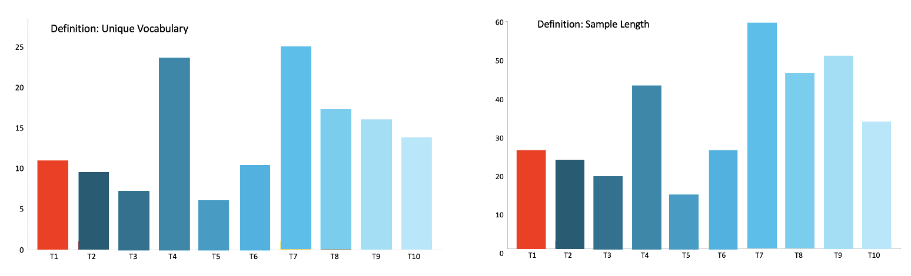
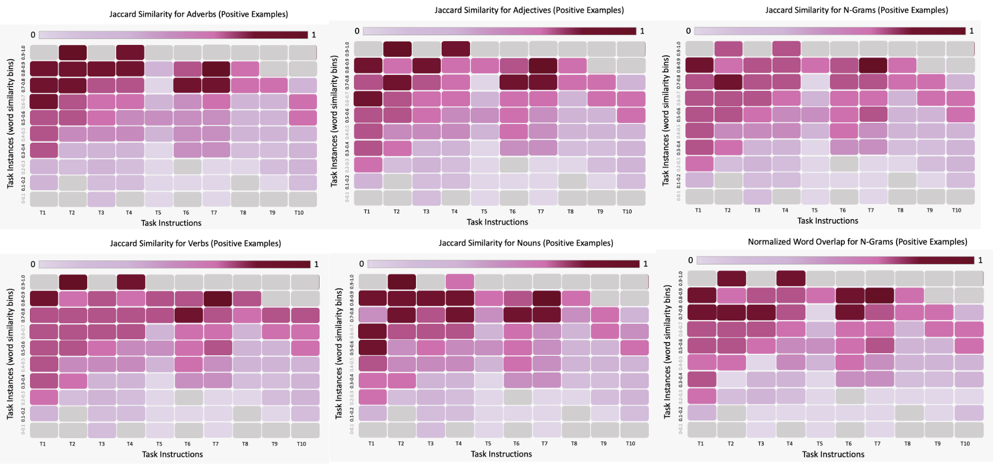
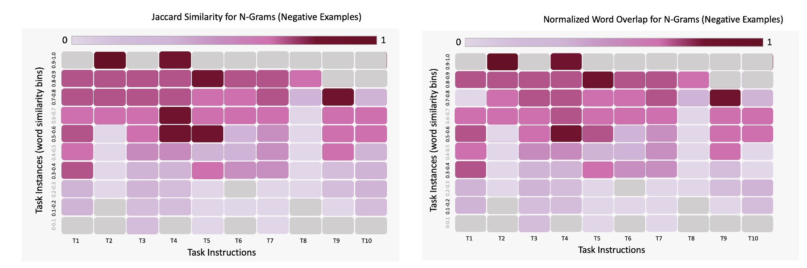

# LINGO-Eurovis-2023

We investigate answer generation tasks, i.e., tasks which require word/sentence answers from the model to answer a given question.

---

## Embedding Space for Answer Generation

We note that answer generation tasks are distributed sparsely around the sphere. There are also no tight local clusters based on the source datasets. This indicates higher linguistic diversity in the task definitions for this task type.

**Insight: Further investigation of answer generation tasks belonging in a given quadrant of the embedding sphere.**

---

## Selecting Root Instruction

We select the following task for the root instruction:

**Source:** [QASC](https://arxiv.org/pdf/1910.11473.pdf)

**Categories:** Question Answering -> Contextual Question Answering -> Extractive; Text Span Selection; Reasoning -> Commonsense Reasoning

**Definition:** _Write a correct answer to the given question based on its associated fact. Make sure that your answer is contained in the associated fact.Things to avoid: Don't be creative and introduce any new word that is not mentioned in the associated fact! Remember that, the associated fact has been rearranged to form the question. So, the correct answer words must lie within the associated fact.\nEmphasis & Caution: The correct answer can be a word, phrase, or even a sentence._

**Positive Examples:**

1.
            "input": "Fact: pesticides can harm animals. \nQuestion: What can harm animals?",
            "output": "pesticides.",
            "explanation": "The answer is present in the span of the fact."

2.
            "input": "Fact: rain can help form soil. \nQuestion: Rain can help form?",
            "output": "soil.",
            "explanation": "The answer is present in the span of the fact."

3.
            "input": "Fact: rain helps plants to survive. \nQuestion: rain helps plants to?",
            "output": "survive.",
            "explanation": "The answer is present in the span of the fact."

4.
            "input": "Fact: a radio converts electrical energy into sound. \nQuestion: a radio converts electrical energy into?",
            "output": "sound.",
            "explanation": "The answer is present in the span of the fact."

5.
            "input": "Fact: chopping down trees causes animals to move to another habitat. \nQuestion: what might cause animals to move to another habitat?",
            "output": "chopping down trees.",
            "explanation": "The answer is present in the span of the fact."

6.
            "input": "Fact: a protractor  can be used to measure the angles of a prism. \nQuestion: What would you use to measure the angles of a prism?",
            "output": "a protractor.",
            "explanation": "The answer is present in the span of the fact."

7.
            "input": "Fact: lightning can cause harm to animals. \nQuestion: What might cause harm to animals?",
            "output": "lightning.",
            "explanation": "The answer is present in the span of the fact."

**Negative Examples:**

1.
            "input": "Fact: pesticides can harm animals. \nQuestion: What can harm animals?",
            "output": "Plastic.",
            "explanation": "Even though the answer \"plastic\" is factually correct as plastic can harm animals, since it is not present in the given fact is is not a good answer. Note that, the correct answer words must lie within the associated fact."

2.
            "input": "Fact: rain can help form soil. \nQuestion: Rain can help form?",
            "output": "soil and trees.",
            "explanation": "The words \"and trees\" are not present in the associated fact. So, it's a bad answer."

3.
            "input": "Fact: rain helps plants to survive. \nQuestion: rain helps plants to?",
            "output": "survived.",
            "explanation": "Here, the answer does not fit with the question grammatically. The correct answer would have been \"survive\". Remember to copy your answer directly from the given fact, as questions have been formed after rearranging their associated facts."

**Insight: Selecting QASC as the root instruction, compare the distribution of tasks across domains, source dataset, and task type that fall wihtin k=10.**

---

## Correlation

We show correlation views for link thresholds of 0.8, 0.7, and 0.6. The 10 tasks (T1-T10) can be found in the folder "Tasks". The following observations of the linguistic characteristics of various task instructions can be used to provide context to how links are formed between clusters:

#### General Characteristics:
* None of the tasks have the same source dataset.
* All of the tasks fall within the answer generation category.
* None of the tasks use verbatim definitions.
* None of the tasks have common positive/negative examples.

#### Task Nature
* T1-T7 all involve span-based selection to generate the answer. T8-T10 involve the generation of text-content based on the context of input, but which are not necessarily contained within the input.
* T1, T2 exhibit high similarity in the definition, particularly in the case of 'Things to Avoid' as well as 'Emphasis and Caution'.
* T3, T4 use similar language to T1, T2 and additionally specify that the shortest continuous text span should be selected to generate a relevant answer. Therefore they place further constraints on the expected output. 
* T5's definition does not use similar language to T1-T4 in the definition, and in fact has the shortest length definition across all instructions.
* T6, T7 also specify that span-based selection needs to be used for a larger volume of text input (i.e., a paragraph is used as the input instead of 1-2 sentences). T7 additionally provides contextual info on the types of reasoning to perform on the given input. 
* T8-T10 involve the generation of text as output with reference to the input context; however, the text generated does not involve span-based selection, and is instead free response. T8 requires event durations to be specified based on common sense reasoning with relation to the input. T9 explicitly asks for conversational, non-stereotypical answers to be provided as a response to the input. T10 is a story completion task, and requires the model to provide the ending for a 3-sentence story.

**Insight: Tasks T1-T5 are the same task type. T6, T7 parse longer input lengths but are also the same task type. T8-T10 involve answer generation, but produce freeform output instead of span-based selection. Additionally, the similarity of T8, T9, T10 to T1 are 0.72, 0.63, 0.61 respectively. We  must further investigate word overlap and length of the task examples to gauge the impact of task type on level of diversity.**

---

## Instruction Decomposition

### Positive Examples, Word Overlap 

https://user-images.githubusercontent.com/54283572/226142736-1ca42c13-0be0-45f9-be24-989ccc153628.mov

### Negative Examples, Word Overlap 

https://user-images.githubusercontent.com/54283572/226142739-6cfa6aee-95d9-4b80-9d6b-da4feaece7e6.mov

* Comparing word overlap for positive and negative examples respectively (threshold 0.5 since there is greater linguistic variation between tasks, in order to observe chord formation), we find that T1 is linked to T2, T5, T6, T7. T2, T4, T8 are also linked. T9, T10 are not linked to any of the other tasks. 
* On observing the text associated with these tasks using the correlation view, we can conclude that the chord associations follow from the characteristics of the task examples we observe, listed below:
  * In general, the number of positive examples exceeds the number of negative examples for all the tasks; non of the tasks have more than 3 negative examples. Some tasks have a large number of positive examples (>2) -- T1, T4, T6, T7, T10.
  * Overall, the explanations for negative examples show higher linguistic diversity than for positive examples; they also show higher variation in length than the positive examples.
  * T1, T6, T7 have overlap between positive and negative examples; also, the explanations given are short-- they only talk about whether the output is from the input span or not and are formulaic in structure.
  * T3 has no overlap, and has richer explanation text which is unique to each example.
  * T2, T4 have overlap within positive examples and T5 has no overlap; additionally, the explanation text for all these tasks also follows a uniform pattern and mentions that the span is present within the question as the justification for correctness or incorrectness of model output.
  * T8 has overlap between positive and negative examples; the overlapping examples follow similar explanation patterns.
  * T9 has overlap between the positive and negative examples; however the explanations exhibit higher patterns of variation.
  * T10 has overlap within postive examples; however the explanations vary in language and structure.

**Insight: Word overlap is not very useful when comparing T1 to tasks, other than T2 and T5. The diversity of the examples between tasks is such that only those tasks with highly structured, templatized explanations (particularly for positive examples) show significant mutual relationships; we also have to set the threshold quite low to generate chords for tasks other than T1.**

### Positive Examples, Length 

https://user-images.githubusercontent.com/54283572/226142829-aa38de65-32c8-46e1-82cb-8b311a96c132.mov

### Negative Examples, Length

https://user-images.githubusercontent.com/54283572/226142836-72003a4c-f28d-4527-9ebc-3157426bc566.mov

* Comparing length for positive and negative examples respectively (threshold 0.7 since there is comparatively lesser variation in length between tasks):
  *  T1 is linked to T2, T5, T8. These have 1-2 sentence input, produce 1 word output, and have similar length explanations for positive examples. Though length of negative explanations is usually longer than positive ones, they do not vary much across these tasks.
  *  T6, T7 are linked only to each other. These tasks have long, paragraph length inputs, which dictates their low similarity to the other tasks, though the explanation length is comparable to some of the lesser input-volume tasks.
  * T3, T4 are mutually linked. They have slightly longer explanations compared to T1 and T5, and T3 and T4 additionally produce multi-word output. 
  *  T9, T10 are mutually linked. They both produce sentence length output, with an input of 2-3 sentences. Explanations lengths are comparable respectively for postive and negative examples between these tasks. 

**Insight: Length-based comparison seems to depend highly on the input/output volume as opposed to the explanation lengths comparing T1 against T6, T7, T9, T10. Explanations impact this relationship in the case of T3, T4, which outstrip T1 in explanation length; we set the threshold high in order to elicit this result.**

---

## Model Results

* Task instances in bins with higher similarity to the examples are more accurately solved. T1, T2, T6, T7 have similar performance distributions in this regard, with a higher proportion of samples in 0.65+ similarity bins.
* T5, T8 have more diversity in instances in comparison to the positive/negative examples (i.e., most instances range from 0.4-0.6 similarity) 
* All the tasks have some empty bins ranging in either 0.75+ or 0.25- similarity.
* Tasks with greater diversity in the explanation and output text, i.e., T5, T8-T10 have a more uniformly distributed performance.
* Tasks with structured, templatized explanations (T1-T4, T6-T7), as well as those with overlap between positive and negative examples (T1, T6, T7) all show higher average performance, with a higher number of instances in high similarity bins.

**Insight: The lowest performing tasks have no overlap between positive and negative examples, more diverse explanations, and a more uniform distribution in terms of similarity bins. This indicates that models find these tasks relatively more difficult to solve, i.e., these tasks may potentially have lower bias in comparison to remaining tasks.**
---

## Bias Metrics

* Comparing the definitions of the task instructions, T7-T10 contribute higher proportions of unique vocabulary. These tasks also have the maximum length. 
  * When considering the proportion of the length that has unique vocabulary however, T5, T8, T9, T10 have the highest contributions. These tasks are also among those ones that show the lowest model performance. 
  * We note that tasks with the longer definitions (T6, T7) show higher model performance.

* In the above heatmaps, gray cells imply that no samples belong to that word similarity bin.
* Comparing positive examples for task instructions, those instructions with higher model performance have higher Jaccard values (with respect to all POS tags and n-grams) in those task instance bins with high similarity.
  * T5, T8-T10 do not display high jaccard values, so they have greater linguistic variation. This occurs despite T8 following simlar explanation patterns for positive examples as T8 generates a diverse output range, in a different linguistic style to other tasks.
  * The higher similarities seen in T1-T4 stem from templatized explanations being used for the positive examples.
  * Though T6, T7 display relatively more linguistic variation in the explanations, they have a very high input volume; this implies that the input volume dictates the level of Jaccard similarity statistics reported for these tasks.
* The normalized word overlap for n-grams also follows a similar pattern to the Jaccard Similarity.

* In the above heatmaps, gray cells imply that no samples belong to that word similarity bin.
* Comparing negative examples for task instructions, those instructions with higher model performance have higher Jaccard values in those task instance bins with high similarity. 
  * However, the relative values of the similarity are lower than those of positive examples across all the tasks.
  * We specifically compare the Jaccard Similarity and Normalized Word Overlap of n-grams, considering that negative example explanations are easily perceived to have higher linguistic diversity across all the tasks.
  * T4, T5, T9 show some level of templatization in the explanation text; these tasks have different levels of model performance and varying levels of  Jaccard similarity/Overlap bias for higher word similarity bins while they show markedly low values for low similarity bins.
  * T2, T8 have only 1 negative example each. This implies that they might not adequately define the task, particularly in the case of T8 which has lower model performance; these tasks also exhibit lower similarity/overlap values with higher word similarity bins. 
  * T6 has identical input passages for all the negative examples, and similarly structured explanations; so it might insufficiently contextualize the task.
  * The remaining tasks show sufficient variation in terms of linguistic diversity.

**Insight:**
* Longer definitions lead to higher performance. These definitions contain additional text like things to avoid, emphasis on the task nuance, and caution when evaluating task samples, that more robustly define the task for the model. This is a positive consideration that should be used to revise T1.
* Positive examples require more linguistically diverse explanations. This is particularly true for tasks with lower volumes of input/output, as high jaccard similarity values are more likely to stem from explanation as opposed to the input content (when compared to tasks T6, T7, where the length of input is highly weighted.
* Negative examples already have high linguistic diversity in the explanations. However, for some of the tasks, there are very few negative examples; this implies that the task might not be adequately defined for the model. Therefore, a decreased model performance might arise from insufficient inductive bias given by the instruction, as opposed to low spurious bias. 
* Throughout, we see that there is also not much overlap between the example explanations and definition text. While templatization of explanations as seen in T2 or T5 might restrict model capabilities, generating structured explanations, which contain linguistically or logically diverse content in the context of 'Things to Avoid' or 'Emphasis and Caution' from the definition might promote the model's reasoning capabilities while lowering spurious bias.

---

## Impact of Instruction Modification

The modification stages for T1 are: 
* Definition modified
* Example explanations modified 
* Example text modified (i.e., new examples either replace or are added to the instruction)

### Updated Task Content

**The definition length has been increased. We add extra information to Things to Avoid and Emphasis & Caution. We increase the proportion of unique vocabulary for the increased definition length. We also define how different parts of the input are related to provide a shortcut on how to apply commonsense reasoning to solve a given instance.**

---

**Definition:** _Write a correct answer to the given question based on its associated fact. You answer will always be contained within the fact, so for output, select or paraphrase the shortest continuous span (i.e., substring) of text from the fact that is relevant to the question.  Things to Avoid: 1. Do not introduce new vocabulary (not previously seen in the input) in the output. 2. The question is always a paraphrase of the fact. 3. The expected model response is typically the word/phrase/sentence from the fact that is absent from the question. Emphasis and Caution: 1. The correct answer can vary in length as a word, phrase or sentence that lies within the fact. 2. An incorrect answer might repeat a word already present in the question, or use a completely novel term absent from the input._

---

**We reduce the number of positive examples. Examples referencing similar concepts like rain or lightning are removed to provide greater contextual variation, and we add one new example with a different domain of fact. Each explanation for positive examples reiterates different aspects of the definition to justify why an answer is correct or incorrect. This reduces the overlap between instances and the examples, while providing a richer reasoning context (i.e., higher inductive bias) for the model to solve the sample.**

---

**Positive Examples:**

1.
            "input": "Fact: pesticides can harm animals. \nQuestion: What can harm animals?",
            "output": "pesticides.",
            "explanation": "The question paraphrases the fact and does not use the word 'pesticides'."

2.
            "input": "Fact: a radio converts electrical energy into sound. \nQuestion: a radio converts electrical energy into?",
            "output": "sound.",
            "explanation": "The answer is present in the span of the fact. The fact is truncated to generate the question, so the remaining part of the fact is the answer."

3.
            "input": "Fact: automobile engines burn gasoline to convert the fuel's energy into mechanical energy. \nQuestion: Why do automobile engines burn gasoline?",
            "output": "Automobiles burn gasoline to release the chemical energy of the fuel to provide mechanical energy."
            "explanation": "The question asks 'why' and the exact text of the fact is restated to answer to the question."

4.
            "input": "Fact: Scales are used to determine weight in pounds. \nQuestion: How can we find out how much something weighs?",
            "output": "Using scales."
            "explanation": "The output modifies the tense of the verb from the fact and combines it with the subject of the fact 'scales' in order to appropriately respond to the input query."

           
---

**We replace negative examples so that they do not overlap with the positive examples. We select examples that use 'Wh' questions not seen in the positive examples, i.e., the nature of the paraphrase of the fact into the question changes. Each explanation reiterates different aspects of the definition to improve inductive bias for the model. However, the language used in the explanations is comparably diverse to the positive examples; we decrease the jaccard similarity between n-grams and increase the unique vocabulary contributed.**

---

**Negative Examples:**

1.
            "input": "Fact: rain can help form soil. \nQuestion: Rain can help form?",
            "output": "soil and trees.",
            "explanation": "Even though the answer \"soil and trees\" is factually correct as they both are formed by rain, since it is not present in the given fact this is a bad answer. Note that, the correct answer words must lie within the associated fact to be a good response."

2.
            "input": "Fact: A fertilized egg can create an offspring if it's carried until birth. \nQuestion: When does a fertilized egg become an offspring?",
            "output": "When it's carried",
            "explanation": "While the answer is a substring of the fact, it remains a wrong output. You should have utilized all the remaining information in the fact that was absent from the question to generate a phrase such as \"when it's carried until birth\". While the task definition asks for the shortest possible span of text to be used, it also species that all information relevant to the question must be reported in the answer."

2.
            "input": "Fact: Frogs make sounds with the larynx which is in the throat. \nQuestion: Where is the larynx located?",
            "output": "on the throat of a frog",
            "explanation": "Here, the answer does not fit with the question grammatically. The correct answer would have been \"in the throat\" instead of 'on'; additionally, larynxes are located in the throats of all species and not just frogs so the second half of the generated output detracts from its general correctness. Remember to copy your answer directly from the given fact, as questions have been formed after rearranging their associated facts.""
            
---

Overall, this case study seeks to simultaneously increase the inductive bias of the instruction given, while decreasing the spurious bias. By using different styles of explanations for the given output and ensuring no example overlap, we simultaneously increase the vocabulary, POS tag, and n-gram diversity, while either maintaining or decreasing the Jaccard similarity and Normalized Word Overlap. Our net changes lead to an increase in the model performance. Most instances show accuracy closer to the new average accuracy for T1 (0.64); additionally, the instance similarity bins range from 0.35-0.75, which indicates better inductive bias for the model to understand and solve the task.
