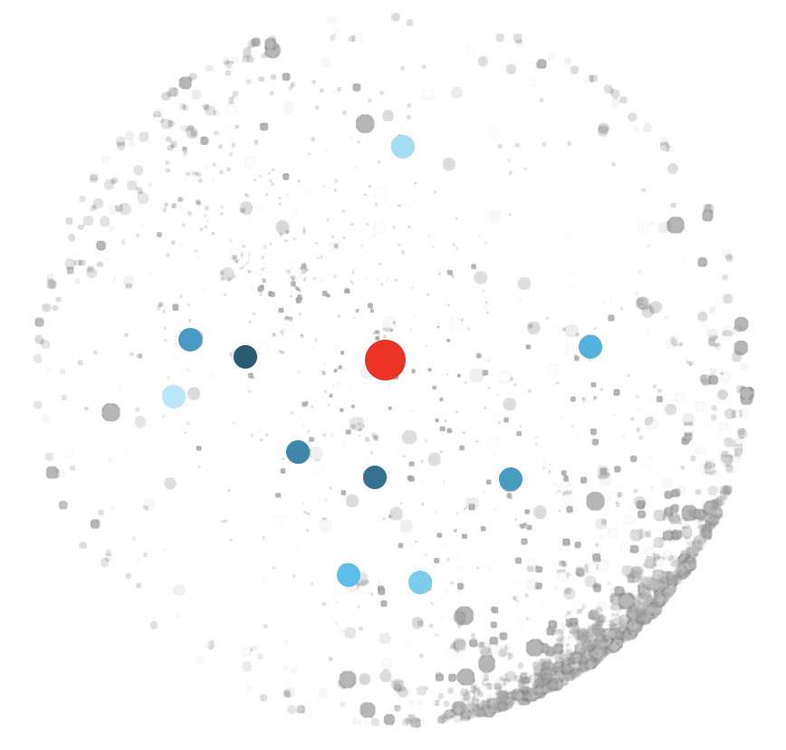

# LINGO-Eurovis-2023

We investigate answer generation tasks, i.e., tasks which require word/sentence answers from the model to answer a given question.
---

## Embedding Space for Answer Generation

We note that answer generation tasks are distributed sparsely around the sphere. There are also no tight local clusters based on the source datasets. This indicates higher linguistic diversity in the task definitions for this task type.

---

## Selecting Root Instruction

We select the following task for the root instruction:

**Source:** [QASC](https://arxiv.org/pdf/1910.11473.pdf)

**Categories:** Question Answering -> Contextual Question Answering -> Extractive; Text Span Selection; Reasoning -> Commonsense Reasoning

**Definition:** _Write a correct answer to the given question based on its associated fact. Make sure that your answer is contained in the associated fact.Things to avoid: Don't be creative and introduce any new word that is not mentioned in the associated fact! Remember that, the associated fact has been rearranged to form the question. So, the correct answer words must lie within the associated fact.\nEmphasis & Caution: The correct answer can be a word, phrase, or even a sentence._

**Positive Examples:**

1.
            "input": "Fact: pesticides can harm animals. \nQuestion: What can harm animals?",
            "output": "pesticides.",
            "explanation": "The answer is present in the span of the fact."
2.
            "input": "Fact: rain can help form soil. \nQuestion: Rain can help form?",
            "output": "soil.",
            "explanation": "The answer is present in the span of the fact."
3.
            "input": "Fact: rain helps plants to survive. \nQuestion: rain helps plants to?",
            "output": "survive.",
            "explanation": "The answer is present in the span of the fact."
4.
            "input": "Fact: a radio converts electrical energy into sound. \nQuestion: a radio converts electrical energy into?",
            "output": "sound.",
            "explanation": "The answer is present in the span of the fact."
5.
            "input": "Fact: chopping down trees causes animals to move to another habitat. \nQuestion: what might cause animals to move to another habitat?",
            "output": "chopping down trees.",
            "explanation": "The answer is present in the span of the fact."
6.
            "input": "Fact: a protractor  can be used to measure the angles of a prism. \nQuestion: What would you use to measure the angles of a prism?",
            "output": "a protractor.",
            "explanation": "The answer is present in the span of the fact."
7.
            "input": "Fact: lightning can cause harm to animals. \nQuestion: What might cause harm to animals?",
            "output": "lightning.",
            "explanation": "The answer is present in the span of the fact."

**Negative Examples:**

1.
            "input": "Fact: pesticides can harm animals. \nQuestion: What can harm animals?",
            "output": "Plastic.",
            "explanation": "Even though the answer \"plastic\" is factually correct as plastic can harm animals, since it is not present in the given fact is is not a good answer. Note that, the correct answer words must lie within the associated fact."
2.
            "input": "Fact: rain can help form soil. \nQuestion: Rain can help form?",
            "output": "soil and trees.",
            "explanation": "The words \"and trees\" are not present in the associated fact. So, it's a bad answer."
3.
            "input": "Fact: rain helps plants to survive. \nQuestion: rain helps plants to?",
            "output": "survived.",
            "explanation": "Here, the answer does not fit with the question grammatically. The correct answer would have been \"survive\". Remember to copy your answer directly from the given fact, as questions have been formed after rearranging their associated facts."

